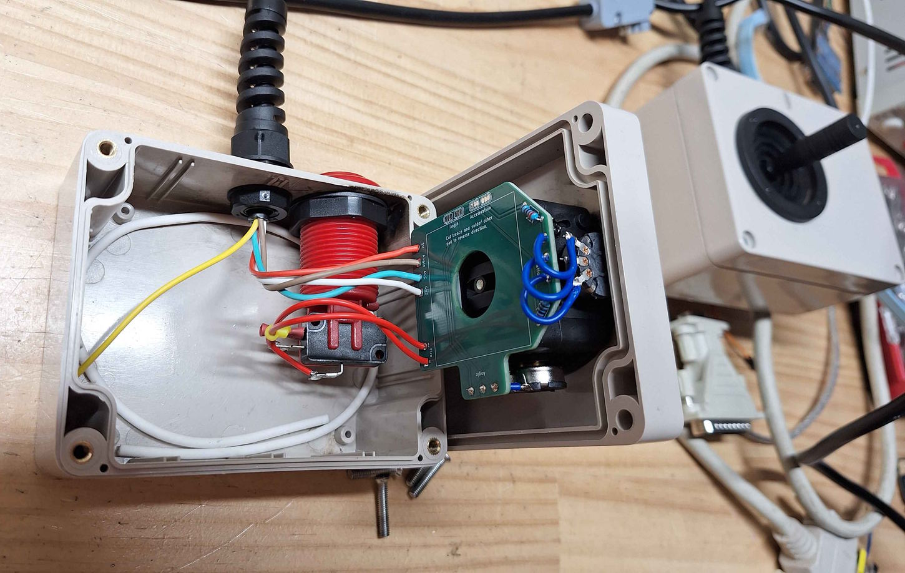
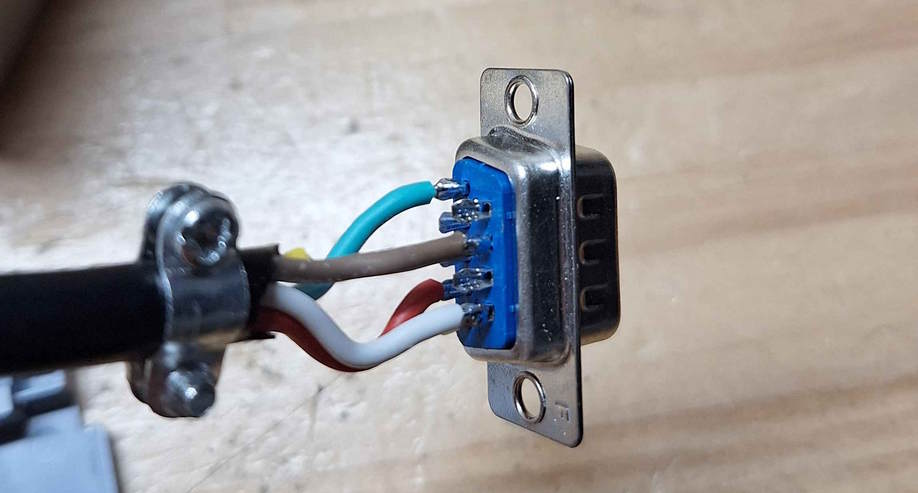
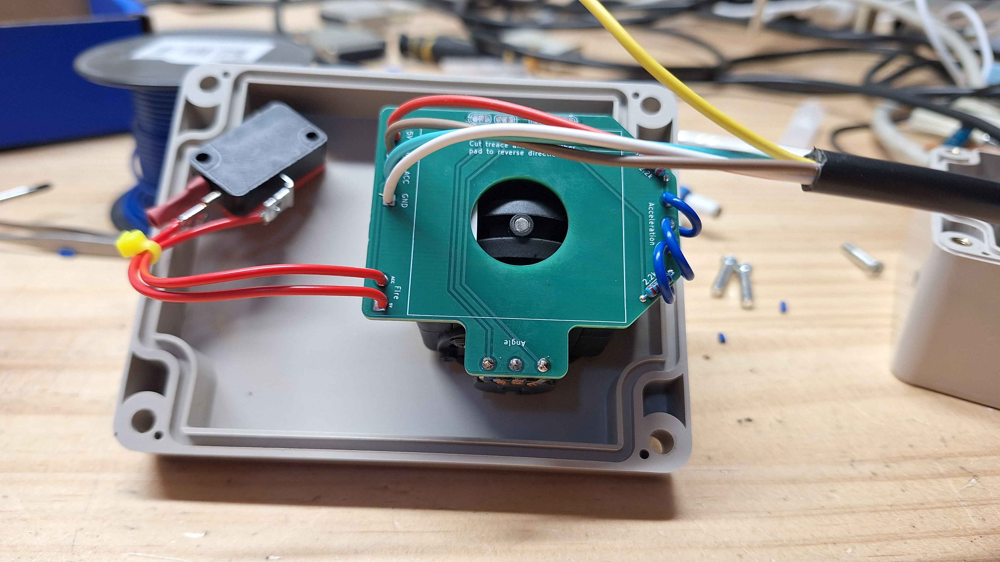

# Joystick Controller #
Here is the needed information to build a basic joystick.

## Bill of Materials ##
 * Project Box (115 x 90 x 55mm) - [Aliexpress Link](https://www.aliexpress.com/item/4001192554657.html)
 * Cable Strain Relief (4.5mm-7.8mm Dia) - [Aliexpress Link](https://www.aliexpress.com/item/1005006247492520.html)
 * Arcade Push Button - [Aliexpress Link](https://www.aliexpress.com/item/32855254679.html)
 * Joystick (JH-D202X-R2 5K 50°)
 * 2x Resistor - 2.2K
 * 4 Core Wire (I used 5 core)
 * DB9 Connector and Housing

## Selection of a Joystick ##
There are quite a few options to choose from, and sometimes the specifications are difficult to find.
This set up has been tested with a joystick that uses potentiometers with the range of 0 to 5kOhm and a range of 50°.

Searching JH-D202X on Aliexpress should provide you with several options to pick from.

## Assembly ##

### Case ###
The case is a little tight, so spend some time to work out where you want to place things.
Take care to allow space for the nut that holds the button.
I have included some KiCad files I used to laser cut holes into the project box (see cut_template_files).
You should be able to print them in paper and use them as a template or just for some dimensions.
Mount the cable, strain relief and push button.

### Wiring ###
In my case I have use the following assignments:
 * Red - 5v
 * Green - Acceleration
 * Brown - Angle
 * White - Ground

On the DB9 Connector I have used the following:
 * Pin 4 - Red - 5v
 * Pin 1 - Green - Acceleration
 * Pin 7 - Brown - Angle
 * Pin 8 - White - Ground

If you build the controller and find that Acceleration and Angle are swapped you CAN"T just swap the Acceleration and Angle wires.
This is because the the fire button is connected to the Acceleration signal. Instead you must rotate the joystick.

### Joystick ###
> Take note of the orientation of the joystick relative to the case, otherwise you may find your controls are backwards!

Before you start make sure you joystick and button fit in the case.
Also make sure you have feed cable through the project box before soldering it to the PCB.

 1. Add the two resistors to the PCB.
 2. Glue the PCB to the bottom of the joystick (I used super glue)
 3. Solder in the potentiometers using loops of wire, allow slack so the potentiometer can be adjusted
 4. Solder in the "Fire" button (the polarity doesn't matter)
 5. Solder in the 4 cables (allow plenty of slack)
 6. Mount the Joystick to the lid

